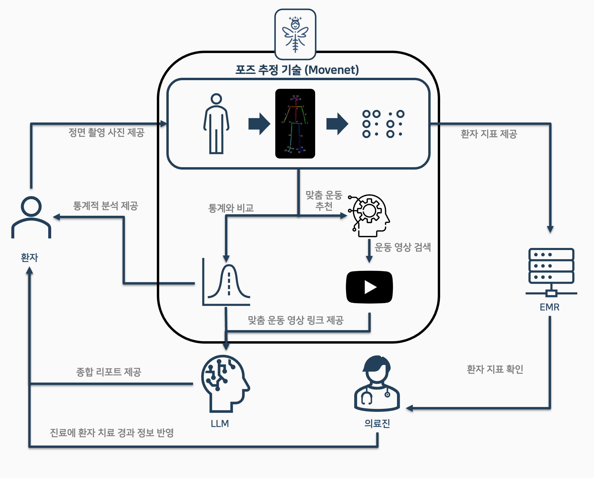

<p align="center">
  
</p>
<h1 align="center">척추의 요정: AI 기반 체형 분석 및 맞춤 운동 추천 서비스</h1>

<p align="center">
  <a href="https://www.python.org/"></a>
  <a href="https://fastapi.tiangolo.com/"></a>
  <a href="https://www.tensorflow.org/"></a>
  <a href="https://scikit-learn.org/"></a>
</p>

<br>

> **일상 속 작은 습관이 만드는 건강한 변화.** 사용자가 단 한 장의 사진으로 자신의 체형을 수치적으로 이해하고, 데이터 기반의 맞춤 솔루션을 통해 스스로 건강을 관리할 수 있는 서비스를 개발했습니다.

<br>

<p align="center">
  
  &nbsp;&nbsp;
  
  &nbsp;&nbsp;
  
  &nbsp;&nbsp;
  
</p>

## 📸 주요 화면

<details>
<summary><strong>자세히 보기: 서비스 주요 기능별 화면</strong></summary>
<br>

| **1. 로그인 및 온보딩** | **2. 사진 업로드 및 가이드** |
| :---: | :---: |
| *로그인, 회원가입 및 분석에 필요한 최소한의 정보(성별/나이)를 입력합니다.* | *정확한 분석을 위해 올바른 자세로 사진을 촬영하도록 안내합니다.* |
|   <br>  |  <br>   |
| **3. 분석 결과 (지표 및 시각화)** | **4. 통계 비교 및 변화 추이** |
| *업로드된 사진을 기반으로 6가지 핵심 지표가 계산되고 시각화됩니다.* | *동일 그룹 내 백분위 정규분포 그래프와 과거 기록 대비 변화 추이를 보여줍니다.* |
|   |  |
| **5. 맞춤 운동 추천 및 LLM 리포트** | **6. 기록 관리 (이전 업로드 조회)** |
| *분석 결과에 따라 추천된 운동, YouTube 영상, LLM 리포트를 함께 확인합니다.* | *과거에 분석했던 모든 기록을 리스트 형태로 다시 조회할 수 있습니다.* |
|  |  |

</details>

---

## 🌟 주요 기능

- **📸 체형 분석**: 단 한 장의 정면 사진으로 6가지 핵심 체형 지표를 정량적으로 분석하고 시각화합니다.
- **📊 통계 기반 비교 리포트**: '한국인 전신 및 포즈 데이터'를 표준 집단으로 가정하여, 자신의 체형이 동일 연령/성별 그룹 내에서 어느 수준(상위 %)에 있는지, **그리고 이전 분석 결과와 비교하여 어떻게 변화했는지**에 대한 객관적인 데이터를 제공합니다.
- **🤸‍♂️ 맞춤형 운동 추천**: 분석된 체형 데이터를 머신러닝 모델이 분석하여, 사용자에게 가장 필요한 교정 운동을 추천하고 관련 YouTube 영상까지 함께 제공합니다.
- **🤖 종합 분석 리포트**: 모든 분석 결과를 종합하여, 사용자가 자신의 상태를 쉽게 이해할 수 있도록 LLM이 생성하는 맞춤형 리포트를 제공합니다.

---

## 1. 프로젝트 개요

<p align="center">
  
</p>

### 문제 제기
**척추측만증**은 증상 없이 만성적으로 진행되는 경우가 많아 '조용한 질병'으로 불립니다. 일시적인 병원 치료만으로는 한계가 명확하며, **자신의 상태를 객관적으로 인지하고 일상 속에서 꾸준히 관리**하는 것이 가장 효과적인 해결책입니다.

### 해결 방안
저희는 데이터 분석과 머신러닝 기술을 활용하여, 사용자가 스마트폰 사진 한 장으로 자신의 체형을 정량적으로 분석하고 **AI Hub 데이터셋을 표준 집단으로 가정한 통계와 비교**하며, 개인에게 최적화된 운동 솔루션까지 제공받는 통합 서비스를 구축했습니다.

## 2. 데이터 분석 및 모델링 파이프라인

본 프로젝트의 핵심은 데이터로부터 가치 있는 정보를 추출하고, 이를 사용자에게 의미 있는 솔루션으로 제공하는 것입니다.

### 2.1. 데이터셋 선정

#### 2.1.1. 데이터 선정 목적
서비스의 핵심 기능인 통계 비교 분석과 맞춤 운동 추천 머신러닝 모델을 학습시키기 위해, 정면 전신 사진으로 구성된 데이터셋이 필요했습니다.

#### 2.1.2. 데이터셋 선정 기준
| 기준 항목 | 이유 |
| --- | --- |
| **정면 전신 이미지** | 어깨, 골반 등의 좌우 대칭 여부를 분석하기 위해 정면 및 전신 이미지가 필수적임 |
| **나이 및 성별 정보 포함** | 사용자에게 동일 연령/성별 그룹과 비교한 통계 정보를 제공하기 위해 필수적임 |
| **관절 라벨(키포인트) 포함 여부** | 사전에 주석 처리된 데이터는 개발 시간을 크게 단축시킴 |
| **공개 라이선스** | 연구 및 서비스 개발에 자유롭게 활용할 수 있어야 함 |

#### 2.1.3. 최종 선정 데이터셋
위 기준에 따라, [**AI Hub의 '한국인 전신 및 포즈 데이터'**](https://aihub.or.kr/aihubdata/data/view.do?dataSetSn=71704)를 메인 데이터셋으로 최종 선정했습니다.

-   **데이터 정제**: 분석 목적에 부합하지 않는 데이터(부적절한 구도, 일부만 촬영된 사진 등)는 모두 정제하여 분석 결과의 신뢰도를 높였습니다.

### 2.2. 포즈 추정 모델 선정

정확한 체형 지표를 추출하기 위해서는 이미지로부터 신체 주요 관절을 안정적으로 감지하는 것이 가장 중요합니다. 이를 위해 4가지 주요 딥러닝 기반 포즈 추정 모델의 성능을 직접 비교 분석했습니다.

<p align="center">
  
  <br>
  <em>각 모델별 관절 좌표 추출 정확도 비교</em>
</p>

-   **평가 기준**:
    1.  **정확도**: `MoveNet`과 `OpenPose`가 다른 모델 대비 월등히 높은 정확도를 보였습니다.
    2.  **처리 속도**: `OpenPose`는 모델이 무거워 실시간 서비스에 부적합했으며, `MoveNet`은 이미지 당 평균 **0.0755초**의 가장 빠른 처리 속도를 기록했습니다.

-   **결론**: 정확도와 속도 모든 면에서 가장 뛰어난 **MoveNet**을 최종 선정했습니다. 특히, 더 높은 정확도를 제공하는 **Thunder 버전**을 사용하여 추출된 관절 좌표의 신뢰도를 극대화했습니다.

### 2.3. 특징 공학

의학적 근거를 바탕으로 **체형 불균형을 가장 잘 설명할 수 있는 새로운 특징들을 생성**했습니다.

<p align="center">
  
  <br>
  <em>핵심 분석 지표 3가지 시각화</em>
</p>

-   **핵심 지표**: 실제 의료 논문에서 척추 만곡 지표인 **Cobb Angle과의 상관관계가 입증된** 3가지 주요 지표를 포함, 총 6가지 지표를 핵심 특징으로 설계했습니다.

### 2.4. 통계 기반 분석 및 점수화

추출된 자세 지표들을 바탕으로 사용자의 현재 상태를 객관적으로 평가하기 위한 통계 분석 및 점수화 로직을 개발했습니다.

**핵심 분석 로직**: AI Hub 데이터를 **표준 인구 집단 데이터베이스**로 활용합니다. 이 DB를 통해 사전에 성별/연령대별 신체 지표의 통계 분포를 구축하고, 새로운 사용자 데이터가 입력되면 이를 표준 집단과 비교하여 **상대적인 백분위 순위를 계산**합니다. 이를 통해 사용자는 '자신의 그룹 내에서 상위 몇 %에 속하는지'를 직관적으로 파악할 수 있습니다.

#### 2.4.1. 기술 통계 분석
분석에 사용된 모든 지표의 기술 통계는 다음과 같습니다.

| 지표명 | 평균 (°/px) | 표준편차 | 최소 | 최대 |
| --- | --- | --- | --- | --- |
| Torso_Vertical_Tilt_deg | 2.3° | 3.1 | -8.1 | 13.2 |
| Ear_Hip_Vertical_Tilt_deg | 1.9° | 2.8 | -7.5 | 11.6 |
| Shoulder_Line_Horizontal_Tilt_deg | 1.2° | 2.4 | -6.3 | 9.7 |
| Hip_Line_Horizontal_Tilt_deg | 0.8° | 2.1 | -5.9 | 8.4 |
| Shoulder_Height_Diff_px | 6.2px | 3.8 | 0.1 | 16.4 |
| Hip_Height_Diff_px | 5.3px | 3.2 | 0.2 | 14.2 |

#### 2.4.2. 비교 분석을 위한 통계적 그룹화
정확한 상대 비교를 위해, 전체 표준 인구 집단 데이터베이스를 **성별(남/여)과 연령대(10대, 20대, 30대, 40대, 50대 이상)로 세분화**하여 최대 10개의 그룹을 구성했습니다.

-   **통계적 신뢰성 확보**: 각 그룹이 최소 50명 이상의 표본을 갖도록 구성하여 통계적 신뢰도를 높였습니다.
-   **이론적 근거**: 중심극한정리에 따라, 표본 크기가 30 이상(보수적으로 50 이상)일 때 해당 표본의 평균과 표준편차는 정규분포에 근사하여 통계적 추정의 신뢰도가 높아집니다.

#### 2.4.3. 상관관계 기반 가중치 점수화
여러 지표를 종합적으로 평가하고 **사용자의 상대적 위치(백분율)를 직관적으로 계산**하기 위해, 단일 **종합 점수**를 생성했습니다. 각 지표의 중요도를 다르게 반영하고자 **논문 기반의 상관계수를 정규화하여 가중치로 사용**하는 가중 평균 방식을 도입했습니다.

-   **참고 논문**: [Clinical Significance Of Pose Estimation Methods C.pdf](./movenet_results/Clinical_Significance_Of_Pose_Estimation_Methods_C.pdf)

-   **가중치 정보**:

| 지표명 | Cobb Angle 상관계수 | 정규화된 가중치 |
| --- | --- | --- |
| Ear_Hip_Vertical_Tilt_deg | 0.85 | 32.8% |
| Shoulder_Line_Horizontal_Tilt_deg | 0.84 | 32.4% |
| Torso_Vertical_Tilt_deg | 0.64 | 24.7% |
| Hip_Line_Horizontal_Tilt_deg | 0.40 | 15.4% |

> **종합 점수 = ∑(지표별 값 × 정규화 가중치)** 방식으로 계산 후, 아래 기준에 따라 상태를 등급화합니다.

| 점수 구간 | 상태 |
| --- | --- |
| 81–100 | 정상 정렬 |
| 61–80 | 약간 불균형 |
| 41–60 | 교정 필요 |
| 0–40 | 심각한 정렬 이상 |

#### 2.4.4. 개인별 통계 리포트
-   **상위 퍼센타일 제공**: 계산된 '종합 점수'가 **자신이 속한 그룹(예: 20대 남성)** 내에서 누적 분포 기준 **"상위 몇 %"**에 해당하는지 구체적인 수치를 제공하여, 자신의 상대적 위치를 명확히 인지할 수 있도록 돕습니다.
    -   *예시: "회원님의 종합 점수는 상위 25%에 해당하며, 약간의 불균형 상태입니다."*

### 2.5. 머신러닝 기반 맞춤 운동 추천

체형 분석으로 불균형을 진단하는 것에서 더 나아가, 사용자에게 실질적인 개선 방안을 제공하고자 했습니다. 이를 위해, 분석된 체형 데이터를 직접 입력받아 개인에게 가장 필요한 맞춤형 교정 운동을 추천하는 머신러닝 시스템을 개발했습니다.

#### 2.5.1. 데이터셋 구축 및 라벨링 전략

-   **데이터 구성**:
    -   총 654개의 샘플로 구성된 데이터셋을 사용했습니다.
    -   **입력 피처**: 성별, 연령대, 그리고 특징 공학을 통해 생성한 6개의 주요 포즈 지표
    -   **타겟**: 추천 운동 라벨
-   **데이터 라벨링**:
    -   **한계점**: 모델의 신뢰도를 위해서는 의료 전문가가 직접 판단한 운동 처방 데이터가 필요하지만, 현실적으로 확보하기 어려웠습니다.
    -   **해결책**: 이 한계를 극복하기 위해, **데이터 기반의 규칙 알고리즘**을 설계하여 수동으로 라벨링을 진행했습니다. 이는 전문가 부재 속에서 최대한의 객관성과 일관성을 확보하기 위한 선택이었습니다.
        1.  **운동 사전 정의**: 자세 교정과 관련된 운동들을 선별하여 '운동 사전'을 구축합니다.
        2.  **불균형 정도 산출**: 각 데이터 샘플에 대해, 주요 신체 부위별 불균형 정도를 수치화합니다.
        3.  **임계값 설정**: 동일 그룹 내에서 각 부위별 불균형 편차의 **75% 분위수**를 교정이 필요한 상태를 구분하는 임계값으로 설정합니다.
        4.  **자동 라벨링**: 특정 부위의 불균형 정도가 이 임계값을 초과하면, 해당 부위 교정에 도움이 되는 운동을 '운동 사전'에서 찾아 라벨로 부여합니다.

> 💡 **Insight**: 이 라벨링 방식은 향후 전문가가 감수한 데이터가 확보될 경우, 해당 데이터를 그대로 입력하여 모델 성능을 크게 개선할 수 있는 확장 가능한 구조입니다.

#### 2.5.2. 머신러닝 모델 학습 및 평가

-   **데이터 전처리**: 결측치 처리, 범주형 변수 인코딩(`LabelEncoder`), 피처 표준화(`StandardScaler`)를 진행했습니다.
-   **데이터 분할**: 데이터 불균형 왜곡을 방지하기 위해 클래스 비율을 유지하며 학습(80%) 및 테스트(20%) 데이터로 분할했습니다.
-   **모델 선택 및 평가**:
    -   `RandomForest`, `GradientBoosting` 등 여러 분류 모델의 **정확도**와 **F1-Score**를 비교했습니다.
    -   **결론**: 모든 평가지표에서 가장 안정적이고 높은 성능을 보인 **RandomForest**를 최종 모델로 선정했습니다.

<p align="center">
  
  <br>
  <em>각 모델별 성능 비교</em>
</p>

#### 2.5.3. 최종 결과 제공: 운동 추천 및 YouTube 영상 연동
-   **운동 추천**: 학습된 `RandomForest` 모델은 사용자의 체형 데이터를 입력받아, 가장 적합한 운동 3가지를 확률과 함께 추천합니다.
-   **YouTube 영상 제공**: 추천된 운동 이름을 검색어로 **YouTube API를 통해 관련 운동 영상을 검색**하고, 사용자에게 제목, 썸네일, 영상 링크를 함께 제공하여 즉각적인 실천을 돕습니다.

### 2.6. LLM 기반 종합 리포트 생성
분석의 최종 단계에서는, 앞서 계산된 모든 정량적 데이터를 종합하여 사용자에게 전달합니다.

-   **입력 데이터**: 사용자의 6가지 핵심 체형 지표, 통계 그룹 내 백분위 순위, 추천 맞춤 운동 정보
-   **처리 과정**: 이 모든 정보를 하나의 프롬프트로 구성하여 LLM에 전달합니다.
-   **최종 결과물**: LLM은 입력된 데이터를 바탕으로, 전문적인 용어를 쉬운 언어로 풀어 설명하고, 현재 상태의 의미와 권장 관리 방안을 포함하는 **개인 맞춤형 종합 리포트**를 생성합니다.

## 3. 시스템 아키텍처 및 실행 방법

### 시스템 구성
-   **Backend (본 저장소)**: `FastAPI`로 구현된 API 서버. 이미지 처리, 머신러닝 모델 추론, DB 연동 등 핵심 로직을 수행합니다.
-   **Frontend**: [oh0227/SpineFairy](https://github.com/oh0227/SpineFairy) (별도 저장소)
-   **Database**: `PostgreSQL`을 사용하여 사용자 데이터 및 분석 결과를 관리합니다.
-   **Deployment**: `Google Compute Engine`를 통해 운영되었습니다.

### 로컬 환경에서 실행하기

1.  **저장소 클론 및 이동**
    ```bash
    git clone https://github.com/clarityth/pose-project.git
    cd pose-project
    ```
2.  **가상환경 생성 및 활성화**
    ```bash
    python3 -m venv .venv && source .venv/bin/activate
    ```
3.  **필수 패키지 설치**
    ```bash
    pip install -r requirements.txt
    ```
4.  **데이터베이스 연결**
    -   로컬 환경에 PostgreSQL을 설치하고 실행해야 합니다.
    -   `app/database.py` 파일 내의 `SQLALCHEMY_DATABASE_URL`을 자신의 로컬 DB 설정에 맞게 수정합니다.

5.  **기준 데이터베이스 채우기 (필수)**
    통계 비교 분석 기능을 사용하기 위해서는, 로컬 데이터베이스에 AI Hub 데이터셋을 기반으로 한 '표준 인구 집단 데이터'가 필요합니다. 아래 명령어를 실행하여 데이터베이스를 채웁니다.
    ```bash
    # 프로젝트 루트 디렉토리에서 실행
    python movenet_results/add_db_from_csv.py
    ```
    > **Note**: 이 스크립트는 `movenet_results` 폴더 내의 CSV 파일들을 읽어 DB에 저장합니다. 실행 전, 4번 단계의 데이터베이스 연결 설정이 올바르게 완료되었는지 확인해주세요.

6.  **API 서버 실행**
    ```bash
    uvicorn app.main:app --reload --host 0.0.0.0 --port 8000
    ```
7.  **API 문서 확인**: 서버 실행 후, 브라우저에서 `http://127.0.0.1:8000/docs` 로 접속하면 모든 API 명세를 확인하고 테스트할 수 있습니다.

## 4. 향후 개선 과제

-   **데이터 라벨링 고도화**: 의료 전문가의 자문을 받아 운동 추천 데이터의 라벨링을 정교화하여 추천 시스템의 신뢰도 향상
-   **실시간 영상 분석**: 정적 이미지를 넘어, 모바일 카메라를 이용한 실시간 동영상 자세 분석 및 교정 피드백 기능 추가
-   **의료 시스템 연동**: 병원 EMR과 연동하여 의료진에게 정량적 환자 데이터 제공